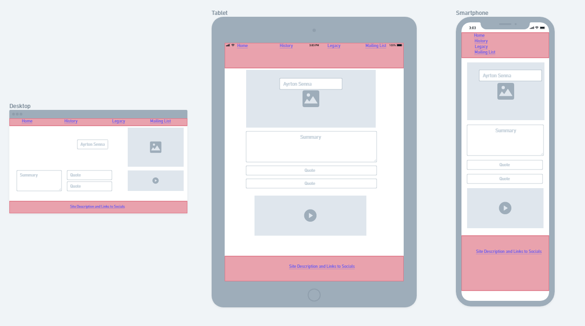
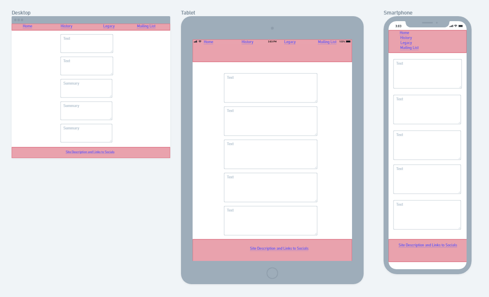
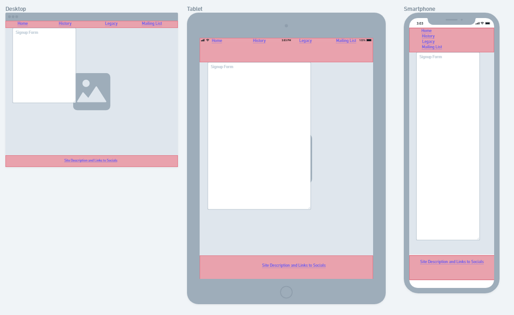

<h1 align="center">Ayrton Senna Website</h1>

[View the live project here.](https://dylanowendev.github.io/milestone-project-one-resubmission/index.html)

This is a mock up of a hypothetical fan page for the Formula One driver, Ayrton Senna.

## User Experience (UX)

-   ### User stories

    -   #### First Time Visitor Goals

        1. As a First Time Visitor, I want to easily understand the main purpose of the site and learn more about Ayrton Senna.
        2. As a First Time Visitor, I want to be able to easily navigate throughout the site to find content.
        3. As a First Time Visitor, I want to look be able to interact with things on the site.

    -   #### Returning Visitor Goals

        1. As a Returning Visitor, I want to be able to interact with new things on the website.
        2. As a Returning Visitor, I want to know the location of other sites where I can find out more about Ayrton Senna.

    -   #### Frequent User Goals
        1. As a Frequent User, I want to check to see if there are any newly added posts or tabs. 
        2. As a Frequent User, I want to sign up to the Newsletter so that I am emailed any updates in relation to the Senna Brand.

-   ### Design
    -   #### Colour Scheme
        -   The two main colours used are Red for foreground text boxes, and black for the background to provide contrast. Greens were also to represent the colours in Senna's race helmet (green, red, yellow).
    -   #### Typography
        -   The font used for the largest headings (on landing page, h1s through doc) is 'Carrois Gothic SC'. Roboto is used for smaller headings (h3 etc), wit Sans Serif as the fallback font in case for any reason either font isn't being imported into the site correctly. 
    -   #### Imagery
        - The large, hero image on the landing page is designed to catch the readers attention. The colour palette was altered to give the image a more muted tone so the image would blend better with the black background, appearing more subtle.

*   ### Wireframes

    -   Home Page Wireframe - 

    -   History / Legacy Wireframe - 

    -   Mailing List Wireframe - 

## Features

-   Responsive on all device sizes

-   Interactive elements such as sign-up form

## Technologies Used

### Languages Used

-   [HTML5](https://en.wikipedia.org/wiki/HTML5)
-   [CSS3](https://en.wikipedia.org/wiki/Cascading_Style_Sheets)

### Frameworks, Libraries & Programs Used

1. [Bootstrap 4.4.1:](https://getbootstrap.com/docs/4.4/getting-started/introduction/)
    - Bootstrap was used to assist with the responsiveness and styling of the website.
1. [Hover.css:](https://ianlunn.github.io/Hover/)
    - Hover.css was used on the Social Media icons in the footer to add the float transition while being hovered over.
1. [Google Fonts:](https://fonts.google.com/)
    - Google fonts were used to import the 'Titillium Web' font into the style.css file which is used on all pages throughout the project.
1. [Font Awesome:](https://fontawesome.com/)
    - Font Awesome was used on all pages throughout the website to add icons for aesthetic and UX purposes.
1. [Git](https://git-scm.com/)
    - Git was used for version control by utilizing the Gitpod terminal to commit to Git and Push to GitHub.
1. [GitHub:](https://github.com/)
    - GitHub is used to store the projects code after being pushed from Git.

## Testing

The W3C Markup Validator and W3C CSS Validator Services were used to validate every page of the project to ensure there were no syntax errors in the project. No bugs in the HTML or CSS were identified.

-   [W3C Markup Validator](https://jigsaw.w3.org/css-validator/#validate_by_input)
-   [W3C CSS Validator](https://jigsaw.w3.org/css-validator/#validate_by_input) 

### Testing User Stories from User Experience (UX) Section

-   #### First Time Visitor Goals

    1. As a First Time Visitor, I want to easily understand the main purpose of the site and learn more about Ayrton Senna.

        1. Upon entering the site, users are automatically greeted with a clean and easily readable navigation bar to go to the page of their choice. Underneath there is a Hero Image with Text and "Arton Senna, F1 Driver" caption. See [here]((https://dylanowendev.github.io/milestone-project-one-resubmission/index.html).
        2. The main points are bolstered with teh adjacent hero image of Ayrton Senna.
        3. The user has two options, to read the text below the hero image or to watch the embedded video to the right.

    2. As a First Time Visitor, I want to be able to easily be able to navigate throughout the site to find content.

        1. The site features a simple navigation bar that provides easy navigation between each page. Simple page names are used.
        2. At the bottom of the page there is a footer with social media links. These are presented in a simple manner.

    3. As a First Time Visitor, I want to look be able to interact with things on the site.
        
        1. The site features an embedded video on the [Index.html](https://dylanowendev.github.io/milestone-project-one-resubmission/index.html) and [Legacy.html](https://dylanowendev.github.io/milestone-project-one-resubmission/legacy.html) pages. These features will keep the visitors attention and may trigger interest, leading them to read more of the site and associated links.

-   #### Returning Visitor Goals

    1. As a Returning Visitor, I want to be able to interact with new things on the website.
      
        1. Although there is no functionality at the moment, future version could incorporate a message forum for fans to discuss Senna and associated topics.

    2. As a Returning Visitor, I want to know the location of other sites where I can find out more about Ayrton Senna.

        1. Links to official social media acounts are included in the footer.
        2. The [Mailing List signup](https://dylanowendev.github.io/milestone-project-one-resubmission/mailinglist.html) also incorpates links within the labels which will redirect the visitor to the respective brands.

-   #### Frequent User Goals

    1. As a Frequent User, I want to check to see if there are any newly added posts or tabs. 

       1. The user would already be comforatble with the website layout and can easily click the banner message.
        
    2. As a Frequent User, I want to sign up to the Newsletter so that I am emailed any updates in relation to the Senna Brand.
    
       1. The user would already be comfortable with the website layout and can easily navigate to the Mailing List tab to sign up.
       2. The [sign-up form](https://dylanowendev.github.io/milestone-project-one-resubmission/mailinglist.html) is a simple design, with a large 'SUBMIT' button.

### Further Testing

-   The Website was tested on Google Chrome, Internet Explorer, Microsoft Edge and Safari browsers.
-   The website was viewed on a variety of devices such as Desktop, Laptop, iPhone7, iPhone 8 & iPhoneX.
-   A large amount of testing was done to ensure that all pages were linking correctly.
-   Friends and family members were asked to review the site and documentation to point out any bugs and/or user experience issues.

### Known Bugs

-   The post function of the signup form uses the Code Institute placeholder URL.

## Deployment

### GitHub Pages

The project was deployed to GitHub Pages using the following steps...

1. Log in to GitHub and locate the [GitHub Repository](https://github.com/dylanowendev/milestone-project-one)
2. At the top of the Repository (not top of page), locate the "Settings" Button on the menu.
    - Alternatively Click [Here](https://raw.githubusercontent.com/) for a GIF demonstrating the process starting from Step 2.
3. Scroll down the Settings page until you locate the "GitHub Pages" Section.
4. Under "Source", click the dropdown called "None" and select "Master Branch".
5. The page will automatically refresh.
6. Scroll back down through the page to locate the now published site [link](https://dylanowendev.github.io/milestone-project-one/index.html) in the "GitHub Pages" section.

## Credits

### Code

-   [Bootstrap4](https://getbootstrap.com/docs/4.4/getting-started/introduction/): Bootstrap Library used in the project mainly to make site responsive (container-fluid).

- Tutorial used for signup form format, [Code Institute](https://learn.codeinstitute.net/courses/course-v1:CodeInstitute+CSE101+2020_Q2/courseware/be0e510a3aca4bccb6e0bba4cf7cf06b/d533998456514d97a88ce691537e00a6/)

- Tutorial used for timeline format, [Code Boxx](https://code-boxx.com/simple-pure-css-timeline )

### Content

-   Homepage text was obtained from [MOTORLAT website](https://www.motorlat.com/notas/f1/13664/senna-039-s-tribute-25-quotes-from-25-people-associated-with-f1)
-   Timeline text was obtained from [McClaren Website](https://www.mclaren.com/racing/heritage/driver/ayrton-senna/10-defining-moments/)
-   Legacy text was obtained from [The Senna Institute](https://institutoayrtonsenna.org.br/en/about-us.html)

### Media

-   [hamiltonavatar](https://images.app.goo.gl/KtQysquiYxM8fgxz6)
-   [schumacheravatar](https://images.app.goo.gl/g9c2CGVNbqyUeLqf7)
-   [sennahero](https://images.app.goo.gl/8nh7wiMQ32BHh2ZS9)
-   [sennaformsignup.jpg](https://images.app.goo.gl/ZfM3NAw7fhJC4B93A)
-   ['sennahistoryX' images](https://www.mclaren.com/racing/heritage/driver/ayrton-senna/10-defining-moments/)